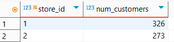
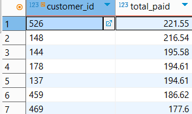
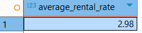
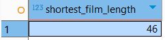
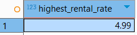
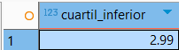
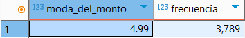

## Tarea #6
### Universidad de Ciencias Físico Matemáticas
#### Maestría en Ciencia de Datos - Bases de Datos Relacionales

## Funciones de agregación

### 1. Conteo de frecuencias o media

**Conteo de cantidad de clientes de cada tienda.**

SELECT store_id , COUNT(customer_id) AS num_customers

FROM customer

GROUP BY store_id;

**Suma de cuánto ha gastado cada cliente ordenado de mayor a menor**

SELECT customer_id, SUM(amount) AS total_paid

FROM payment

GROUP BY customer_id

ORDER BY total_paid DESC;

**Promedio del rate de venta de cada película**

SELECT AVG(rental_rate) AS average_rental_rate

FROM film;

### 2. Mínimos y máximos

**Película con duración más corta**

SELECT MIN(length) AS shortest_film_length

FROM film;

**Película con rate de renta más alto**

SELECT MAX(rental_rate) AS highest_rental_rate

FROM film;

### Cuantil

**Cuartil #1 - el 25% de los pagos son menores a el siguiente número:**

SELECT (SELECT amount

     FROM (SELECT amount,

             ROW_NUMBER() OVER (ORDER BY amount) AS rn,

             COUNT(*) OVER () AS total_rows

         FROM payment) AS sub

     WHERE rn = CEIL(0.25 * total_rows)) AS cuartil_inferior;

### Moda

**Moda del monto pagado**

SELECT amount AS moda_del_monto,

    COUNT(amount) AS frecuencia

FROM payment

GROUP BY amount

HAVING COUNT(amount) = (SELECT MAX(conteo_monto)

        FROM (SELECT COUNT(amount) AS conteo_monto

            FROM payment

            GROUP BY amount) AS frecuencias_por_monto)

ORDER BY amount;

### Hallazgos / Dificultades en la implementación

Como comenté en la Tarea #5, recientemente elegí trabajar con esta BD y al tener 16 tablas, en ocasiones me es difícil encontrar la tabla que me va a dar los datos que me van a llevar a la respuesta que busco. Creo que cuando empecemos a utilizar JOINS podré realizar análisis más complejo.

Me ha costado familiarizarme con la sintaxis pero con la práctica ha sido posible escribir mis querys más facilmente.
También, cuando estoy estrcuturando la query, se me difucultaba encontrar la lógica por tenerlas ordenadas de una manera no amigable visualmente. Investigué la mejor manera de ordenarlas y recordé lo visto en clase. Aplicar la estrcutura recomendada facilitó la detección de errores y el mejor entendimiento de mis querys.