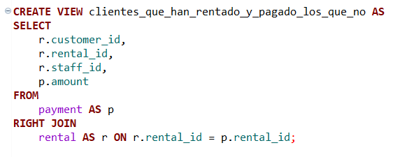

## Tarea #8
### Universidad de Ciencias Físico Matemáticas
#### Maestría en Ciencia de Datos - Bases de Datos Relacionales

### Vistas utilizando JOIN's

Da click [aquí](https://github.com/GemaGuerraV/BDR/blob/main/Tareas/Tarea8.sql) para ver mi código SQL.

### Explicación de vistas

#### LEFT JOIN

Al ser un LEFT JOIN, nos arroja todos los clientes y se relaciona con la tabla de las películas rentadas, aún cuando un cliente no haya rentado este aparecerá en la lista al ser la tabla izquierda y la iformación relacionada a la tabla rentals aparecerá como NULL.
La tabla muestra el id del cliente, su primer nombre, el id de renta, fecha de renta y de retorno y el id del empleado que lo rentó.
Me di cuenta que todos los empleados han rentado al menos una vez.
LEFT JOIN tabla izquierda(customer) tabla derecha (rentals)

#### RIGHT JOIN

Al ser un RIGHT JOIN, nos arroja todas las rentas y se relaciona con la tabla de los pagos, aparecerán todos los IDs de renta
al ser la tabla derecha y la información relacionada a la tabla payments aparecerá como NULL en caso de que no se haya pagado.
La tabla muestra el id del cliente, el id de renta, el id del empleado que lo rentó y la cantidad pagada.
Me di cuenta que todas las rentas han sido pagadas
RIGHT JOIN tabla izquierda(payment) tabla derecha (rentals)

#### JOIN

Esta vista usa JOIN's y nos muestra el nombre de la película rentada,el nombre del cliente que la rentó, la fecha de renta y de regreso, la persona que lo rentó y la tienda en la que se realizó la renta.
También, hace la diferencia de fecha de retorno contra fecha de renta para saber los días que tardaron en regresarlo.

#### SUBCONSULTA

Esta vista permite ver los clientes que aún no han regresado las películas rentadas y arroja los días que van desde la renta hasta el día actual.

### Explicación de disparador

#### TRIGGER

Ayuda a no permitir una renta si el cliente tiene 1 o más rentas pendientes de regresar de más de 7 días.

- **Tema para el proyecto:** Tableau
